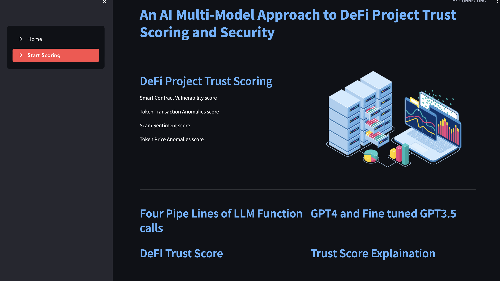

This repo is part of our research work

@INPROCEEDINGS{10664378,
  author={Mothukuri, Viraaji and Parizi, Reza M. and Massa, James L. and Yazdinejad, Abbas},
  booktitle={2024 IEEE International Conference on Blockchain (Blockchain)}, 
  title={An AI Multi-Model Approach to DeFi Project Trust Scoring and Security}, 
  year={2024},
  volume={},
  number={},
  pages={19-28},
  keywords={Codes;Accuracy;Social networking (online);Smart contracts;Pipelines;Finance;Decentralized applications;DeFi;Decentralized Finance;Security;Scam Detection;Rug Pull;AI;LLMs;GPT},
  doi={10.1109/Blockchain62396.2024.00013}}

Below are the steps to spin up the app. 

* Update src/config.ini with below API keys:
`
[etherscan]

ether_api_key = ""

[bscscan]

bscscan_api_key = ""

[ftsscan]

ftscan_api_key = ""

[google]
search_api_key = ''

search_engine_id = ''

huggingfacestkn = ''

[openai]
openai_api_key = ''
`

* from the source folder create the virtual env and install the pre-requsites from requirements.txt file.

